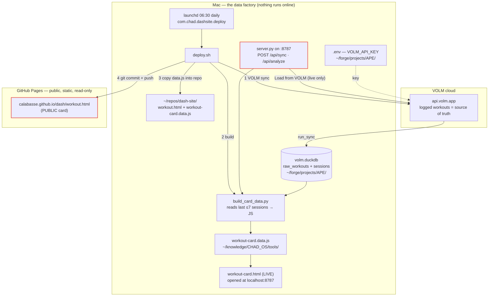
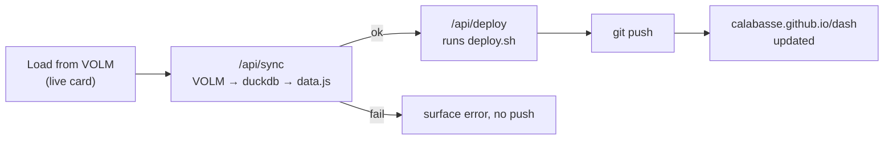

# Workout card — data workflow

Where the data lives and how it reaches GitHub Pages.

## Source of truth → local DB → card data → GitHub

## Two cards exist (they had drifted)

| | LIVE card | PUBLIC card |
|---|---|---|
| File | `~/knowledge/CHAD_OS/tools/workout-card.html` | `~/repos/dash-site/workout.html` |
| Served by | `server.py` at `localhost:8787` | GitHub Pages (static) |
| "Load from VOLM" | works → `POST /api/sync` | inert ("static mode") |
| Reaches GitHub? | **No** — only rebuilds the local `data.js` | Yes, but only when `deploy.sh` runs |

## The gap you're feeling

- The public page's **Load from VOLM** button can't do anything: GitHub Pages is
  static, there is no `/api/sync` there, and the `SERVED` guard only allows sync
  from `localhost`.
- The live launcher's button **does** sync VOLM and rebuild the card — but
  `server.py` **never git-pushes**, so the public site is unchanged.
- So today the only paths to update the public "last 4" are: wait for the
  06:30 launchd job, or run `./deploy.sh` by hand.

## Proposed: one-click "Load from VOLM → live on GitHub"

Add `POST /api/deploy` to `server.py` that runs `deploy.sh`, and chain it after a
successful sync in the LIVE card's button. Then: open the live launcher → click
**Load from VOLM** → sync + rebuild + `git push` → public site live in ~1 min.
No secrets leave the Mac; reuses the existing `deploy.sh`.

